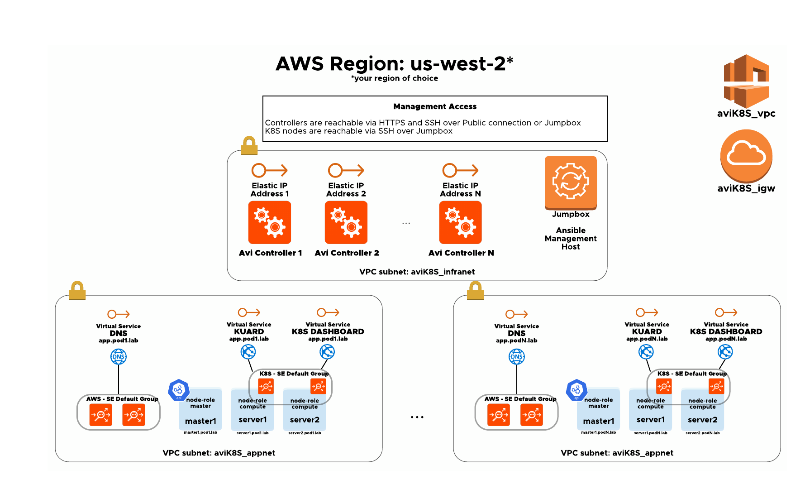

# improved-telegram

## Solution Overview

Extensible deployment framework starting from the infrastructure layer covered by Terraform up to the configuration management handled by Ansible.

The current repo deploys n-number of target K8S pods with VMware NSX Advanced Load Balancer (Avi Networks) as Ingress Controller on AWS.

## Authors

 - Adrian Steer (as679)
 - Sergey Marunich (smarunich)
 - Shawn Watson (shamusx)

## Topology



## Requirements

 - Terraform >= 0.12.10
 - Ansible >= 2.9.2
 - AWS

     **NOTE**: all the deployment work was performed within avitools container: [https://github.com/avinetworks/avitools](https://github.com/avinetworks/avitools)

## Getting Started

 1. Clone the repository - [https://github.com/as679/improved-telegram/](https://github.com/as679/improved-telegram/)

```
root@avitools:~# git clone https://github.com/as679/improved-telegram
Cloning into ‘improved-telegram'...
```

 2. Initialize a Terraform working directory
 ```
root@avitools:~/improved-telegram# terraform init
Initializing the
backend... Initializing provider plugins... Checking for available
provider plugins...

* provider.aws: version = "~2.50"
* provider.local: version = "~1.4"
* provider.random: version = "~2.2"
* provider.template: version = "~2.1"
* provider.tls: version = "~2.1”

Terraform has been successfully initialized!
```
3. Copy the minimum required variables template
```
root@avitools:~/improved-telegram# cp sample_terraform_tfvars terraform.tfvars
```
4. Fill out the required variables - terraform.tfvars

    **NOTE**: Avi Controller AMI must be shared with the target AWS account
```
#terraform.tfvars
aws_access_key = ""
aws_secret_key = ""
aws_region = "us-west-2"
avi_admin_password = ""
avi_default_password = ""
avi_backup_admin_username = ""
avi_backup_admin_password = ""
pod_count = 1
```
5. For more variable details please refer to vars_*.tf files such as **vars_ami_ids.tf**, vars_pod.tf, vars_infra.tf
6. Prepare the terraform plan
```
root@avitools:~/improved-telegram# terraform plan

…

Plan: 33 to add, 0 to change, 0 to destroy.
------------------------------------------------------------------------
Note: You didn't specify an "-out" parameter to save this plan, so
Terraform can't guarantee that exactly these actions will be performed
if "terraform apply" is subsequently run
7. Apply the terraform plan
aviadmin@avitools:techsummit# terraform apply

…
Plan: 33 to add, 0 to change, 0 to destroy.
Do you want to perform these actions?   Terraform will perform the
actions described above.   Only 'yes' will be accepted to approve.

Enter a value: yes

...

Apply complete! Resources: 40 added, 0 changed, 0 destroyed.

Outputs:
Controller_PublicIP = [
"54.188.71.166",
"54.185.115.180",
]
Jumpbox_PublicIP = 54.202.241.121
Master_PublicIP = [
"34.213.245.110",
"34.221.24.201",
]
8. Review the environment details
aviadmin@avitools:techsummit# terraform output
 Controller_PublicIP = [
"54.188.71.166",
"54.185.115.180",
]
Jumpbox_PublicIP = 54.202.241.121
Master_PublicIP = [
"34.213.245.110",
"34.221.24.201",
]
```
9. SSH into the environment
```
 aviadmin@avitools:techsummit# ls keys/
generated-access-key-polecat.pem  generated-access-key-polecat.pub
 aviadmin@avitools:techsummit# ssh -i keys/generated-access-key-polecat.pem 54.202.241.121 -l ubuntu
 ```
10. (Optional) Check the registered inventory
```
ubuntu@jumpbox:~$ cat /etc/hosts
...
172.20.0.202	jumpbox.pod.lab
54.202.241.121	public.jumpbox.pod.lab
172.20.1.157	master1.pod2.lab
34.221.24.201	public.master1.pod2.lab
172.20.1.127	server2.pod2.lab
50.112.180.171	public.server2.pod2.lab
172.20.1.134	master1.pod1.lab
34.213.245.110	public.master1.pod1.lab
172.20.1.244	server2.pod1.lab
52.43.221.124	public.server2.pod1.lab
172.20.1.30	server1.pod2.lab
54.185.175.111	public.server1.pod2.lab
172.20.0.31	controller.pod2.lab
54.185.115.180	public.controller.pod2.lab
172.20.0.130	controller.pod1.lab
54.188.71.166	public.controller.pod1.lab
172.20.1.247	server1.pod1.lab
54.201.30.215	public.server1.pod1.lab
ubuntu@jumpbox:~$ /etc/ansible/hosts --list
```
11. SSH to the pod 1 K8s Master and lookup the dashboard token
```
ubuntu@ip-172-20-1-134:~$ kubectl describe secret kubernetes-dashboard -n kubernetes-dashboard
Name:         kubernetes-dashboard-certs
Namespace:    kubernetes-dashboard
Labels:   k8s-app=kubernetes-dashboard
Annotations:  <none>

Type:  Opaque

Data
====

Name:         kubernetes-dashboard-csrf Namespace:
kubernetes-dashboard Labels:       k8s-app=kubernetes-dashboard
Annotations:  <none>

Type:  Opaque

Data
==== csrf:  256 bytes

Name:         kubernetes-dashboard-key-holder Namespace:
kubernetes-dashboard Labels:       <noneAnnotations:  <none>

Type:  Opaque

Data
==== priv:  1675 bytes pub:   459 bytes

Name:         kubernetes-dashboard-token-fkjgx Namespace:
kubernetes-dashboard Labels:       <noneAnnotations:
kubernetes.io/service-account.name: kubernetes-dashboard
              kubernetes.io/service-account.uid: dc5c2003-c9c8-49f4-b7c3-c22c2a6b99bc

Type:  kubernetes.io/service-account-token

Data
==== ca.crt:     1025 bytes
namespace:  20 bytes
token:     eyJhbGciOiJSUzI1NiIsImtpZCI6IndvMjBrQWo4eEo5UkNDaUN4ei1iQ21FdVdhZVFqQV9OdEU5SjhGZFBBS2sifQ.eyJpc3MiOiJrdWJlcm5ldGVzL3NlcnZpY2VhY2NvdW50Iiwia3ViZXJuZXRlcy5pby9zZXJ2aWNlYWNjb3VudC9uYW1lc3BhY2UiOiJrdWJlcm5ldGVzLWRhc2hib2FyZCIsImt1YmVybmV0ZXMuaW8vc2VydmljZWFjY291bnQvc2VjcmV0Lm5hbWUiOiJrdWJlcm5ldGVzLWRhc2hib2FyZC10b2tlbi1ma2pneCIsImt1YmVybmV0ZXMuaW8vc2VydmljZWFjY291bnQvc2VydmljZS1hY2NvdW50Lm5hbWUiOiJrdWJlcm5ldGVzLWRhc2hib2FyZCIsImt1YmVybmV0ZXMuaW8vc2VydmljZWFjY291bnQvc2VydmljZS1hY2NvdW50LnVpZCI6ImRjNWMyMDAzLWM5YzgtNDlmNC1iN2MzLWMyMmMyYTZiOTliYyIsInN1YiI6InN5c3RlbTpzZXJ2aWNlYWNjb3VudDprdWJlcm5ldGVzLWRhc2hib2FyZDprdWJlcm5ldGVzLWRhc2hib2FyZCJ9.mP6iUT_I7ckVpxxGVLPWcwhqwytcewKzrOQRIvJcwS_Qrm1XUUS-ZLP2LA_knyDHyGVLTYmlldAy0AIk_SpD4YcfoipINEUrUsocGg40QqdV0sSVmDwgUlgNbprIrwB02XfCBMwHWVF6ABi9nwQgNSVcZBj8wMkYeTxIP8uBeVGVK08MzZWu4w9N_NRhmWpQF2Uzh6x_nr6AldhzAH7QdiDqVwahZ_88X7lu5qaq-j2KYwHkhciQVa6-SfZ4W96TRDOVwEdnZejIqKNDDS5kdXa1bUGYnrwkZSAQvkJ-oCWkQt2D9EhE8Fv-tx-uXdlMMqLZmp1msu6NeSjm_ijh5w
```
12. Login to the pod 1 Avi Controller, navigate to "All Tenants" view, find the kubernetes-dashboard virtual service and access the public IP of kubernetes dashboard with the token looked up in the previous step.
